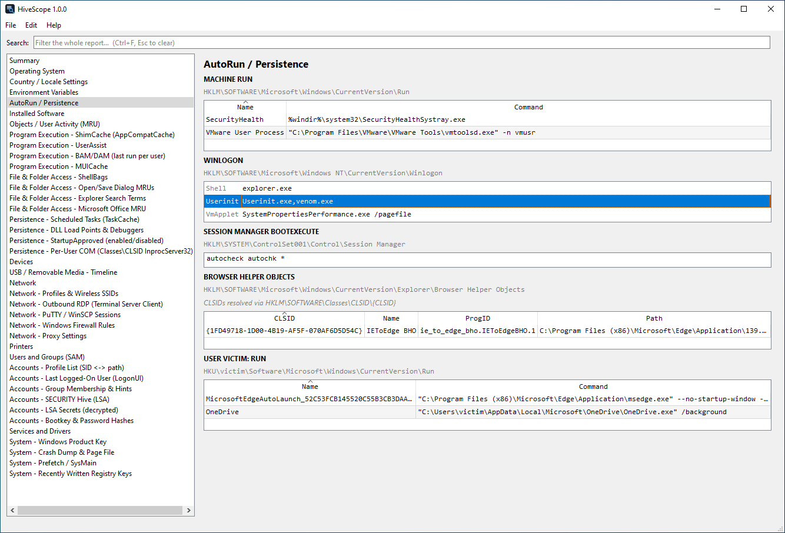

# HiveScope

`HiveScope` is a tool for analyzing Windows registry hives. It parses `SYSTEM`, `SOFTWARE`, `SAM`, `SECURITY`, `NTUSER.DAT` and `UsrClass.dat` hives to produce a forensic report (HTML, JSON or TXT) and a timeline.



## Features

- Loads `SYSTEM`, `SOFTWARE`, `SAM`, `SECURITY`, any number of `NTUSER.DAT` hives and their matching per-user `UsrClass.dat`, or auto-detects them all from a folder.
- Broad artifact coverage: OS/install and locale, autoruns and persistence, program execution (ShimCache, UserAssist, BAM/DAM, MUICache), file and folder access (ShellBags, dialog MRUs, Office MRUs), USB history, network profiles and remote access, local accounts, groups and services.
- Credential recovery: bootkey (syskey), NT/LM password hashes from `SAM`, and LSA secrets from `SECURITY` (DPAPI keys, service/autologon passwords, cached domain-credential key).
- Easily search for values of interest to the investigation.
- UTC timeline across every timestamped artifact.
- Reports in HTML, plain text and JSON.

## Requirements

- Python 3.8+
- `python-registry` (parsing), `PyQt6` (GUI) and `pycryptodome` (NT/LM hash decryption), see `requirements.txt`.

```
pip install -r requirements.txt
```

## Usage

Launch the GUI:

```
python3 HiveScope.py
```

Then use **File -> Import from folder…** and pick a collection root, or open the hives individually.

Headless / scripted:

```
# auto-detect hives under a folder and write an HTML report
python3 HiveScope.py --folder /path/to/collection --html report.html

# name the hives explicitly, write a text report
python3 HiveScope.py --system SYSTEM --software SOFTWARE --sam SAM --ntuser alice=alice/NTUSER.DAT --text report.txt

# write a JSON report
python3 HiveScope.py --folder /path/to/collection --json report.json

# write a CSV timeline
python3 HiveScope.py --folder /path/to/collection --timeline timeline.csv
```

The timeline defaults to events on or after the OS install date to cut pre-install noise; use `--timeline-all` to include everything, or `--timeline-since YYYY-MM-DD` to set a custom date. Password-hash and LSA-secret decryption require the `SYSTEM` and `SAM`/`SECURITY` hives from the same machine.

## Building executables

```
./build.sh      # Linux / macOS  --> dist/HiveScope
build.bat       # Windows        --> dist\HiveScope.exe
```

## Project structure

```
HiveScope.py                # thin launcher (python3 HiveScope.py)
build.sh / build.bat        # single-file executable builds
requirements.txt
hivescope/
  const.py                  # name / version
  core.py                   # accessors, conversions, SAM parsing, service maps
  model.py                  # section model + full registry-path builders
  hives.py                  # hive loading / REGF detection / folder discovery
  shellitems.py             # shell-item (PIDL) parser for ShellBags and dialogs
  crypto.py                 # bootkey, NT/LM hashes, LSA secret decryption
  sections.py               # core extractors + report assembly
  sections_exec.py          # ShimCache, UserAssist, BAM/DAM, MUICache
  sections_files.py         # ShellBags, ComDlg32 MRUs, WordWheel, Office MRU
  sections_persist.py       # scheduled tasks, DLL load points, COM hijacks
  sections_accounts.py      # ProfileList, SAM groups, SECURITY, hashes, LSA secrets
  sections_network.py       # NetworkList, RDP, PuTTY/WinSCP, firewall, proxy
  sections_usb.py           # USB timeline, WPD names, drive-letter correlation
  sections_system.py        # product key, crash/pagefile, prefetch, timeline
  reporting.py              # text, HTML and JSON renderers
  timeline.py               # cross-artifact timeline (CSV/JSON)
  gui.py                    # PyQt6 GUI
  cli.py                    # argument parsing + entry point
  assets/                   # icon.png / icon.ico
```

## License

This project is licensed under the MIT License. See [LICENSE](LICENSE) for details.
